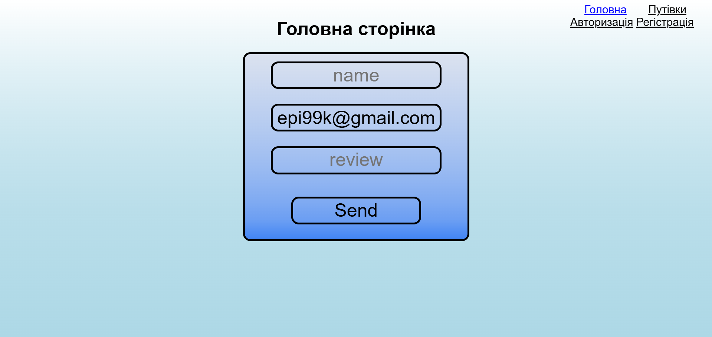
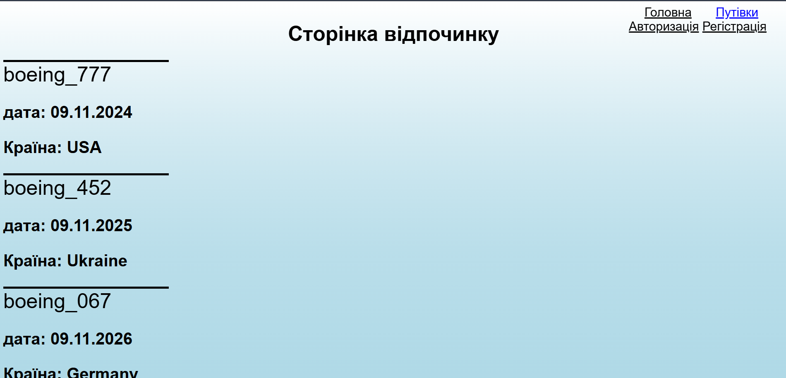
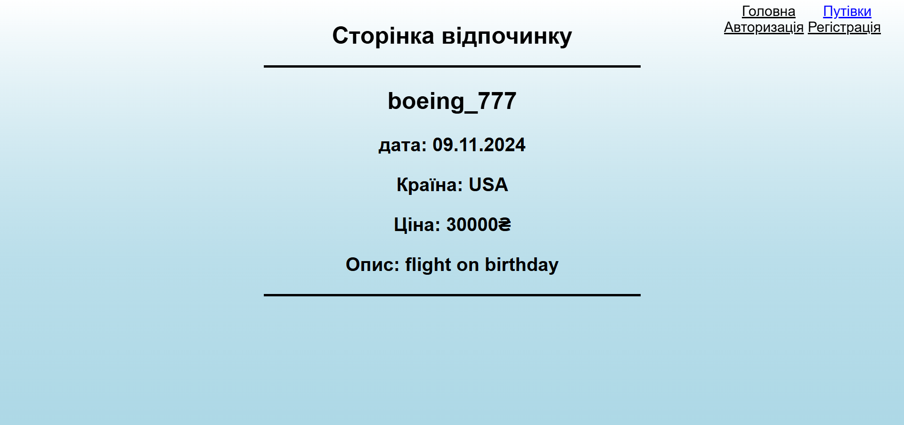
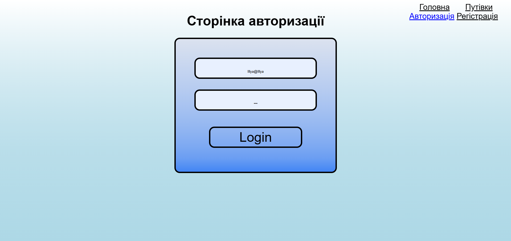
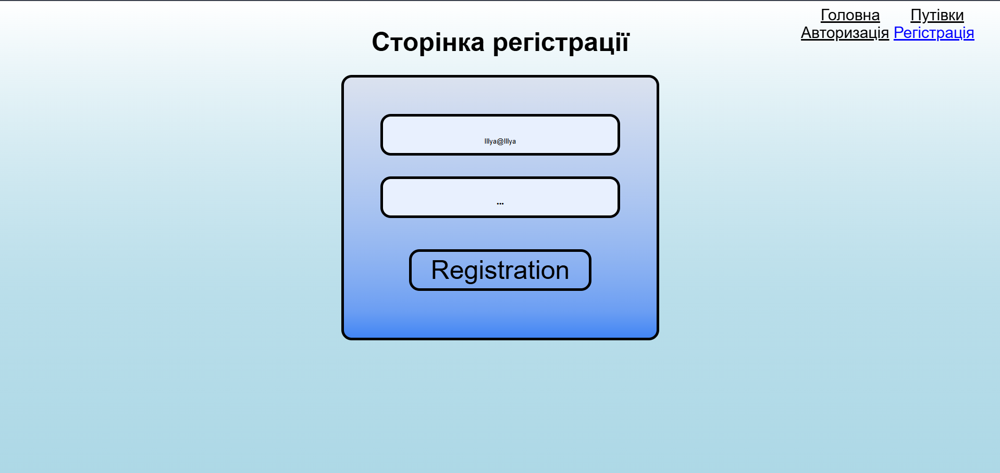
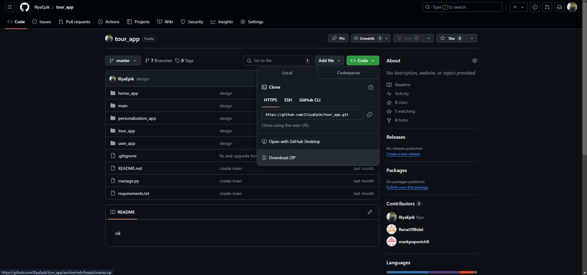

# tour app:

# instruction:

+ download zip on computer
+ 
+ open terminal in folder with project
+ python -m venv venv
+ venv/Scripts/activate.bat (windows)
+ source activate venv/bin (mac os)
+ write in terminal pip install -r path to requirements.txt
+ cd main 
+ flask --app settings db init
+ flask --app settings db migrate
+ flask --app settings db upgrade
+ cd ..
+ python manage.py 